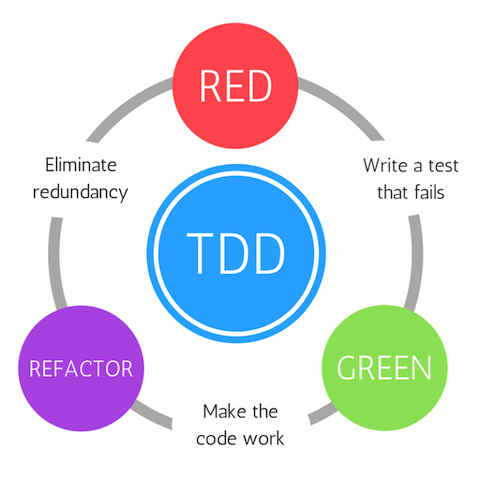

# <!--fit--> Golang by P'Yod

Training golang by P'Yod
15 - 16 Feb 2020
at THINK SOciety: Co-working Space & Cafe

---

## การติดตั้ง ภาษา Go ##
## วิธี run and compile ##

* การ compile ข้าม platform

## การเขียน Unit testing ##

* TDD concept

---

# <!--fit--> TDD concept 

---



*Note - Test Driven Design Posted on December 9, 2018 [TDD Estilo Londres](https://josemyduarte.github.io/2018-12-09-tdd-outside-in/).*

---
# วิธีการ Run test 

```sh
go test -v
```

```sh
=== RUN   TestFizzBuzzSayOrigin
=== RUN   TestFizzBuzzSayOrigin/given_1_say_1
--- PASS: TestFizzBuzzSayOrigin (0.00s)
    --- PASS: TestFizzBuzzSayOrigin/given_1_say_1 (0.00s)
=== RUN   TestFizzBuzzSayFizz
=== RUN   TestFizzBuzzSayFizz/given_3_say_Fizz
--- PASS: TestFizzBuzzSayFizz (0.00s)
    --- PASS: TestFizzBuzzSayFizz/given_3_say_Fizz (0.00s)
=== RUN   TestFizzBuzzSayBuzz
=== RUN   TestFizzBuzzSayBuzz/given_5_say_Buzz
--- PASS: TestFizzBuzzSayBuzz (0.00s)
    --- PASS: TestFizzBuzzSayBuzz/given_5_say_Buzz (0.00s)
PASS
ok      hello/fizzbuzz  0.192s
```

---
# วิธีการ Run test แบบ Need tags

```sh
├── fizzbuzz
    ├── fizzbuzz.go
    ├── fizzbuzz_integration_test.go
    └── fizzbuzz_test.go
```

use diractory `fizzbuzz`

```sh
cd fizzbuzz
```

run test

```sh
go test -tags integration -run TestFizzBuzz1To100
```

---
# Anonymous Function

---
# First-Class Function

---
# Higher-Order Function


---

# defer

รับ  exques function


```go
package main

import "fmt"

func main() {
    defer fmt.Println("end")

    fmt.Println("Hello, Gophers")
}

```

---

```go
package main

import "fmt"

func main() {
    doSomething(4)
}

func doSomething(n int) {
    defer fmt.Println(n) //1
    defer func() { //2
        fmt.Println(n) //4
    }()
    n = n * n
    fmt.Println(n) //3
}
```

---

# Anti func

type cache

```go

package main

import "fmt"

func main() {
    catchMe()
}

func catchMe() {
    defer func() {
        if r := recover(); r != nil {
            fmt.Println(r)
        }
    }()

    s := []int{}

    fmt.Println(s[1])
}
```

---

# jwt.io
เป็นแค่การทำ  jode

header ทำ signature ด้วยอะไร

*go get github.com/dgrijalva/jwt-go*

issuer เป็นใคร

*https://godoc.org/github.com/dgrijalva/jwt-go#example-NewWithClaims--StandardClaims*